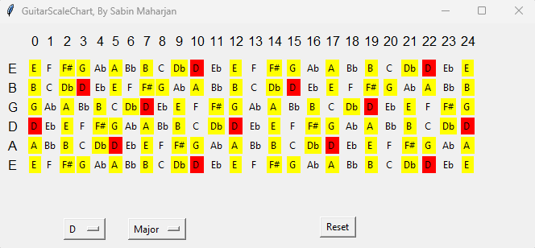

# python-guitar-scale-chart
A 24-fret guitar scale chart for many popular scales, modes, and keys.
It is built up of python3 and uses tkinter.

# Options:
## Scales:
 * Major
 * Natural minor
 * Harmonic minor
 * Melodic minor
 * Dorian mode
 * Phrygian mode
 * Lydian mode
 * Mixolydian mode
 * Locrian mode
 * Ahava raba mode
 * Minor pentatonic
 * Pentatonic
 * Blues

## Chords:
 * 5 chord
 * Major chord
 * Minor chord
 * Diminished chord
 * Augmented chord
 * Sus2 chord
 * Sus4 chord
 * Maj7 chord
 * min7 chord
 * 7 chord
 * min7b5 chord
 * dim7 chord
 * 9 chord
 * Maj9 chord
 * m9 chord
 * 11 chord
 * Maj11 chord
 * min11 chords

## Output

